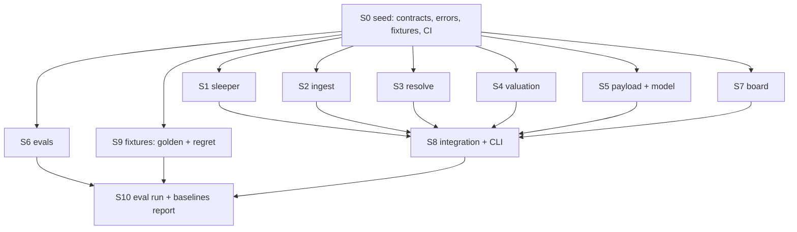

# vorpal — v1 implementation plan

**Contract:** `docs/SPEC.md`. This file is the *how*. If the two disagree, the
spec wins and this file is wrong.

**Goal:** a working draft-night loop before draft day. Everything else is
optional.

---

## 1. Decisions

### D1 — Contract-first, not vertical slices

One blocking seed session freezes every type the modules pass to each other.
After it merges, eight sessions run at once and none of them wait on another.

The alternative — build a thin end-to-end slice, then widen it — serialises the
work. It is the right call for one developer discovering the shape of a problem.
The shape is already in the spec, so it buys nothing here and costs all the
parallelism.

Cost of this choice: a wrong contract is expensive, because every session
depends on it. Mitigated by D3 (record real fixtures *before* writing the
contract, so field names come from the wire, not from memory).

### D2 — Pure core, thin IO shell

Every module takes parsed data and returns data. No module holds an HTTP client.
`sleeper` and `ingest` own transport and hand back typed rows; `resolve`,
`valuation`, `payload`, `evals`, `board` never touch the network.

Three things fall out of this:

- Six of eight sessions need no network mocking at all.
- The 99% coverage gate becomes reachable — pure functions cover cheaply.
- The stability gate (§5) can replay a payload without a live draft.

### D3 — Fixtures are recorded, sanitised, committed

`tools/record_fixtures.py` hits the real endpoints once and writes redacted JSON
to `tests/fixtures/`. Manager names and league identity are stripped on the way
in (AGENTS.md: no league data in a shared repo). Every session tests against the
same bytes.

This is in the seed and is the seed's real work. Contracts written from the
documentation and not from a recorded response are how eight sessions all
discover the same wrong field name on day three.

### D4 — Contracts are frozen; amendments are serialised

`src/vorpal/contracts.py` is the one file every session imports and no session
owns. After the seed, a change to it is its own small PR against `main`,
reviewed and merged alone, and the sessions rebase. Expect two or three. Expect
zero is the failure mode — it means someone bent their module around a bad type.

### D5 — Shared files are enumerated and neutralised

Merge conflicts between agents are the whole risk of this approach. Shared
files, each with a rule:

| File | Rule |
|---|---|
| `pyproject.toml` | All v1 deps declared in the seed. Sessions add none. |
| `src/vorpal/contracts.py` | Frozen. D4. |
| `src/vorpal/platform/base.py` | Frozen. New hosts are new files, not edits here. |
| `src/vorpal/errors.py` | Frozen. Taxonomy is complete in the seed. |
| `docs/PLAN.md` | A session edits only its own status row. |

Everything else is one directory, one owner. Handoff notes go in
`docs/handoffs/SN.md`, one file per session, so they cannot conflict at all.

### D6 — The model call is faked in unit tests, live only under a marker

`payload/` and `model/` unit tests use a stub transport and a recorded response.
The live call runs under `-m live` and never in CI. The stability gate (5
identical payloads) is expensive and non-deterministic by nature; it belongs to
the eval run, not to `pytest`.

### D7 — Board is a written HTML file, not a server

Each poll writes a complete self-contained `board.html` and the page
meta-refreshes. No framework, no port, no async. The renderer is a pure
function from `(Payload, Proposal, age_seconds)` to a string, which is
snapshot-testable and cannot break on draft night in a way tests would not
catch.

### D8 — Integration is one session, last, and owns the CLI

`src/vorpal/cli.py` has exactly one owner (S8) and is written after the modules
merge. No session wires itself into the entry point. This is what keeps the
eight parallel branches from all touching the same forty lines.

---

## 2. The graph



S1 through S7 and S9 are **fully concurrent**. They share no file. They can be
merged to `main` in any order as they go green.

Critical path is S0 → S4 → S8 → S10. S4 (valuation) is the longest single
session; start it first.

---

## 3. Sessions

| ID | Scope | Owns | Depends | Status |
|---|---|---|---|---|
| S0 | Seed: contracts, errors, fixtures, CI, docs | root, `contracts.py`, `errors.py`, `platform/`, `tests/fixtures/`, `tools/` | — | DONE |
| S1 | Sleeper documented reads | `src/vorpal/sleeper/**` | S0 | DONE |
| S2 | FantasyPros forecast (stats, ADP, ECR) + override | `src/vorpal/ingest/**` | S0 | DONE |
| S3 | Slots, scoring source, seat, refusals | `src/vorpal/resolve/**` | S0 | DONE |
| S4 | Scoring, VOLS, weekly vector, delta | `src/vorpal/valuation/**` | S0 | DONE |
| S5 | Board cap, payload, model call | `src/vorpal/payload/**`, `src/vorpal/model/**` | S0 | NOT STARTED |
| S6 | The eleven gates, three baselines | `src/vorpal/evals/**` | S0 | NOT STARTED |
| S7 | HTML board, poll loop, data age | `src/vorpal/board/**` | S0 | NOT STARTED |
| S8 | CLI, wiring, end-to-end test | `src/vorpal/cli.py`, `tests/e2e/**` | S1–S5, S7 | NOT STARTED |
| S9 | Golden set + regret fixtures | `tests/golden/**`, `tests/regret/**` | S0 | NOT STARTED |
| S10 | Eval run, baseline table, dress rehearsal | `evals/**`, report | S6, S8, S9 | NOT STARTED |

Prompts: `docs/prompts/S1.md` … `docs/prompts/S10.md`.

---

## 4. Cut line

If draft day arrives and something is unfinished, ship in this order and drop
from the bottom:

1. S0, S1, S3 — you can read the draft. Without this there is no tool.
2. S2, S4 — you have a board of numbers. `argmax_vols` alone is already useful.
3. S7 — you can read the board under a pick timer.
4. S5 — the model recommends. Schema and VOLS-dissent gates run inline.
5. S8 — one command instead of three.
6. S6, S9, S10 — the gates and the evidence they work.

Dropping 6 means shipping a policy you have not measured. That is a real cost
and the spec says so (§8: the golden set is the main eval limit). It is still
the right thing to drop last, because a measured tool you cannot run on draft
night is worth nothing that night.

---

## 5. Session protocol

Standing rules, also in AGENTS.md.

**Start.** Create a worktree, never switch branches in a shared checkout:

```
git worktree add ../vorpal-sN -b feat/<scope> main
```

**During.** Touch only the files your prompt says you own. If you need a
contract change, stop and open a separate contract PR (D4).

**Finish.** Before you open the PR:

1. Write `docs/handoffs/SN.md` — what you built, what you learned that the next
   session cannot see from the code, anything in the spec that turned out to be
   wrong or ambiguous.
2. Update your own row in the §3 table above to `DONE` (or `BLOCKED: reason`).
3. Update the prompt file of every session that depends on you, with the real
   function signatures they will call and any gotcha you hit.
4. If your work makes a *new* session necessary, write its prompt file and add
   its row.

A PR that does not do all four is not finished.
