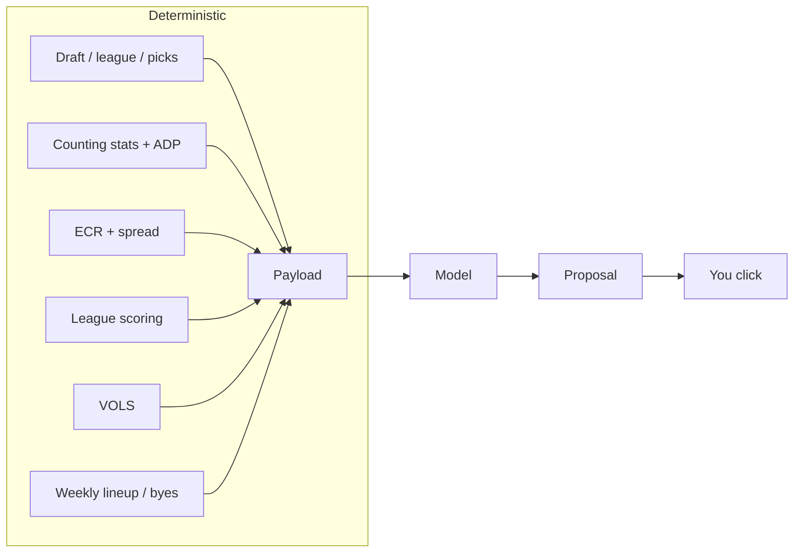
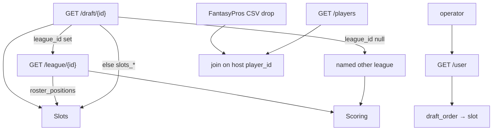
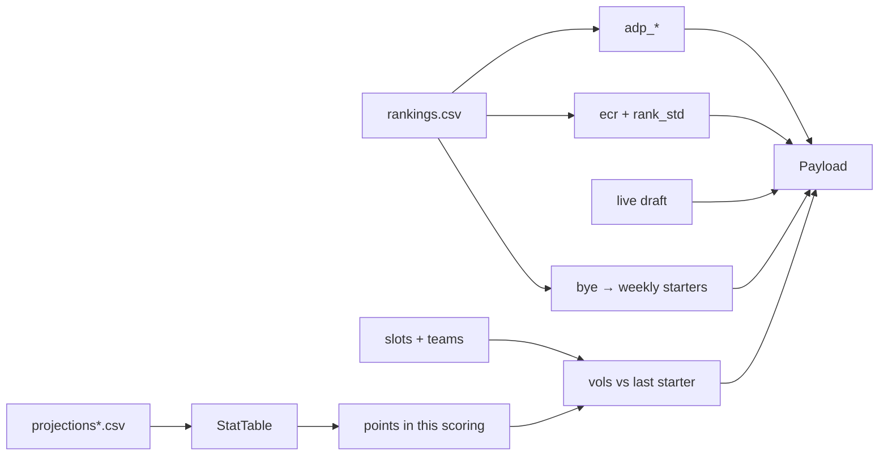
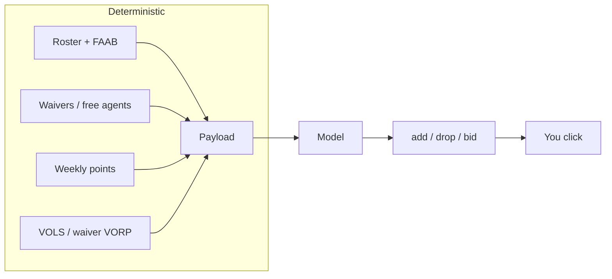

# vorpal

**Status:** v1 implemented.
**v1:** Sleeper NFL, snake redraft, offense-only. Personal tool.

An agent. Code builds a board of numbers. The model picks. You click in
Sleeper. The [Sleeper API is read-only](https://docs.sleeper.com/).



v1 is the draft loop. Waivers and lineups reuse this shape; diagram in §7.

---

## 1. Boundary

| In v1 | Out |
|---|---|
| Documented Sleeper reads | Any write / browser automation |
| Counting stats → this league's points → VOLS | Ingesting fantasy-point columns (`points`, `pts_*`) |
| FantasyPros stats, ADP, ECR + `rank_std` as inputs **and** a sanity eval, read from CSV exports the operator saves by hand (§3) | ECR as the pick. Any script, scraper, or browser drive that fetches FantasyPros |
| Weekly starter points (bye = 0) | True weekly projections (v2) |
| Model recommendation | Argmax(VOLS) as the pick |
| Binary evals only | Soft scores, “lean”, calibrated probabilities |
| Human executes | Multi-step search, run detector, VONA |

---

## 2. Configure

Inputs: **draft id**, **operator** (username or `user_id`), **scoring-source league id** iff `draft.league_id` is null, **FantasyPros drop directory** (default `private/fp/`, §3), optional override CSV. v1 takes no FantasyPros API key, because v1 *is* the drop. A paid key is a §7 item, not an input now.



[Draft](https://docs.sleeper.com/#get-a-specific-draft) has no `scoring_settings`. `metadata.scoring_type` is a label, not a table. Standalone mocks are readable and have `league_id: null`. Slots come from the mock; scoring is borrowed. Banner both. They may disagree.

**Slots, once:** league `roster_positions` if the draft belongs to a league; else `draft.settings.slots_*`. Infer bench only when `slots_bn` is absent and the league list did not fire: `rounds − starter slots`. A borrowed scoring league never overrides slots.

| Slot | Eligible |
|---|---|
| QB | QB |
| RB / WR / TE / K / DEF | that position |
| FLEX | RB, WR, TE |
| SUPER_FLEX, OP | QB, RB, WR, TE |
| BN | any |

IDP slot codes: refuse the draft.

**Seat.** Match operator `user_id` in `draft_order` (not `picked_by`, which is `""` for CPU). Unset order → proceed, omit `next_user_pick`. Partial order and operator missing → explicit slot or refuse. Complete order and operator missing → refuse.

### Refuse

| Condition | Signal |
|---|---|
| Keeper / dynasty | `settings.type ∈ {1,2}` or `taxi_slots > 0` |
| Unknown type | `type` absent or not in `{0,1,2}` (`0` = redraft, observed; `1`/`2` inferred) |
| IDP | IDP slots in the resolved list |
| Auction / linear / `reversal_round ≠ 0` | draft type / settings |

`max_keepers > 0` on `type == 0` is **not** a refusal. Banner *keepers possible* and proceed. When a pick has a truthy `is_keeper`, drop that player from the pool.

Four refusal classes, all loud: **format**, **data**, **platform**, **user**. No silent zeros.

---

## 3. Features (code) → payload (model)

All of this is computed. None of it is the pick. VBD terms:
[VORP / VOLS / VONA](https://support.fantasypros.com/hc/en-us/articles/115005868747-What-is-value-based-drafting-What-do-player-draft-values-mean-VORP-VONA-VOLS-VBD-).
Worked intuition: [What is value-based drafting?](https://www.fantasypros.com/2017/06/what-is-value-based-drafting/).



### Sources

| Feature | Source | Notes |
|---|---|---|
| League / draft / picks / players / user | Host. v1: documented [`api.sleeper.app`](https://docs.sleeper.com/) | Stay under 1000 calls/min. `/players` is the join directory (host id, `yahoo_id`, name, pos, team). |
| Counting stats | FantasyPros **projections** CSV export(s) in the drop: one per position, or combined | Host-neutral forecast. Loaded **once per process** from disk, never fetched. Joined to host `player_id` (Mapping, below). |
| ADP + ECR + spread + bye | FantasyPros **consensus rankings** CSV export in the drop | Required file. One overall list: the Overall (ALL) cheat sheet in 1QB, Superflex (OP) in superflex. Joined to host `player_id` (Mapping, below). `RK` is overall draft order, not positional. |
| Override | CSV keyed by host `player_id` | Replaces stats + ADP when the projections drop is missing or unreadable. No name match. No ECR. |

Do not filter `/players` by `active=true`. `search_rank` is not ADP.

**Stats contract (FantasyPros):** season totals — the draft projections export, never a weekly page. Counting keys only — never ingest `FPTS`, `FPTS PPR`, `points` / `points_ppr` / `points_half` / `pts_ppr` / `pts_std` / `pts_half_ppr`, or any other `pts_*` column. Flatten the export's headers onto the FP wire names (Drop, below), then map those onto this **host's** scoring keys through `FP_TO_HOST` in `ingest/keys.py`, unchanged (`pass_yds` → Sleeper `pass_yd`). ESPN has no rows yet. Do not invent kicker distance buckets or `pts_allow_*` from coarse FP fields (`FG`, `PA`, `YDS AGN`). Unmatched nonzero scoring keys banner; they must not silent-zero. Rows with ADP and no stats are market-only: excluded from VOLS, and so excluded from the section 4 board, which ranks on VOLS. Keep them in the pool — they still count against the mapping gate.

**ADP variant**, from resolved slots + `rec` weight: SUPER_FLEX / OP / 2+ QB slots → `2qb`; else `rec ≥ 0.75` → `ppr`; `0.25–0.75` → `half_ppr`; else `std`. Banner when `rec` is not exactly `1/0.5/0`. The variant names the cheat sheet the operator saves (Drop, below): `2qb` → the Superflex (OP) list; else the Overall (ALL) list in STD / HALF / PPR. ADP is the rankings export's `ADP` column. Ingest does not select scoring over HTTP, and there is no `adp_1qb_market` second fetch: the ADP on the board is the list that was dropped. `fp_drop_age` names the list the variant calls for, so the operator can check the file against it. There is no `adp_2qb_ppr`.

**ECR:** `ecr` (`RK`), `ecr_min` (`BEST`), `ecr_max` (`WORST`), `ecr_std` (`STD.DEV` — expert spread, the upside/uncertainty input), all from the rankings export; the API names `rank_ecr` / `rank_min` / `rank_max` / `rank_std` are aliases. One overall consensus list: ALL in 1QB, OP in superflex, scoring STD / HALF / PPR by the same `rec` rule. Do not stitch positional lists — those ranks all start at 1 and are not `ecr_best`. `AVG` is `rank_ave`, the mean expert rank; it is neither `ecr` nor ADP. Join miss → omit ECR, ADP, and bye from that row, banner `ecr_join_miss` with the count. Blank ECR cells on a joined row → omit ECR on that row. No ECR column at all → banner `ecr_missing`, still call the model. Spread columns absent → banner `ecr_spread_missing`; `ecr` ships, `ecr_min` / `ecr_max` / `ecr_std` are omitted. Do not block a draft on ECR joins or ECR columns. Missing ECR skips the ECR eval, it does not fail it. A missing rankings *file* is different: that is a DataRefusal (Drop, below), because the file also carries ADP and bye.

**Weekly / byes / absence.** Host `/players` has no bye. Take bye from the FantasyPros rankings export (`BYE`; API name `player_bye_week`). v1 does not fetch weekly projections. For weeks `1..18`, rate = `points / 17` (or `/ gp` when present); **0 on that player's bye**, and **0 on weeks the player is known out** — a served suspension is weeks `1..n`. Dividing by `gp` and then filling every non-bye week rebuilds a full season for a player who does not play one. Where `gp < 17` and the missed weeks are not knowable, do not guess which: ship `gp` on the board row and let the model read the gap between season `points` and per-game rate. That gap is the whole case for a discounted returning starter, and season totals hide it. Fill the user's starting slots by those rates. Ship the 18-week vector: starter points and any empty startable slot. That is week-by-week strength. v2 replaces the rate with real weekly stats.

**Marginal value.** Recompute that vector with a candidate added and ship the
difference as `delta_starter_points` on each board row. `vols` is global — the
same number whether you hold zero RBs or four. This is the same player against
*your* roster. Byes are already zeros in the vector, so a bye stack shows up as
a smaller delta instead of as arithmetic the model has to do in its head.

**Override columns:** `player_id` (required, a host id), counting stats the scoring keys need, `adp`. Optional: `adp_stdev`, name/team/pos. No name match, no ECR columns: it is the `player_id`-keyed backup for stats + ADP only, orthogonal to the drop. Projections missing from the drop and no override → data refuse. With an override, `rankings.csv` is still required: it supplies ECR and bye and still orders the mapping gate; the board's ADP is the override's. The rankings file has no override equivalent.

### Drop

FantasyPros numbers arrive as CSV exports the operator downloads from the
website by hand, about 15 minutes before the draft, and saves into one
directory. v1 has no API key and no HTTP to FantasyPros, for any board: draft
night, evals, rehearsals. The reason is the free tier, not the idea
of an API. The public API returns 10 players per list and its paging is
decorative — PR #39 probed it live: `page=2`, `offset=10`, and `limit=100` all
return 10 rows, `public_api_limited: true`, `tier: free`. A 10-player board is
a toy, and a toy must not ship as real.

**No hybrid.** v1 reads the drop or it refuses: there is no "API, then CSV"
path and no "CSV, then API" path, and a missing or unreadable drop is a
`DataRefusal`, never a fallback to the 10-player API.

The drop is v1's stopgap for a toy free tier, not the forever architecture. A
later paid key is a second extractor on the same contract (§7), not a rewrite:
same FP wire names, same counting-stats rule, the same `HostPlayerIndex` join
order below. New sources add an extractor, not a new matcher. It is not a v1
input, and it does not add a draft-night fallback.

**Nobody automates the download.** Vorpal, its tools, its tests, and any agent
working in this repo must not fetch, script, scrape, or browser-drive
FantasyPros to produce these files. The operator clicks Export. That is the
whole acquisition step.

**Which pages to save.** Two exports. Both match the league through the ADP
variant above.

| File | FantasyPros page | Choose |
|---|---|---|
| `rankings.csv` | Draft **consensus rankings**, the overall cheat sheet | `2qb` → Superflex (OP). Else Overall (ALL). Scoring STD / Half / PPR from the `rec` rule. Never a positional list. |
| `projections.csv`, `projections-*.csv`, or `projections/*.csv` | Draft **projections**, one page per position: QB, RB, WR, TE, K, DST | Season (draft) totals, not a week. Scoring only changes `FPTS`, which is never read. |

**Layout.** The drop is a directory. The §2 input overrides the directory, not
the filenames.

```
private/fp/rankings.csv          # exactly one overall consensus list (required)
private/fp/projections.csv       # optional combined projections
private/fp/projections/*.csv     # positional projection exports (qb/rb/wr/te/k/dst)
private/fp/projections-*.csv     # same, flat
```

`private/fp/` and `data/fp/` are gitignored. These files are paid or personal
FantasyPros data and never enter the repo.

**Load.** Once per process, before the first board. Rankings and projections
are read independently, each joined to host `player_id` (Mapping, below), then
attached to each other on host id. Do not require the two files to join to
each other first. After load, the draft-night loop (§6) never re-reads them
and never touches FantasyPros. The same drop is the season snapshot: no live
refresh for waivers in v1.

| Condition | Result |
|---|---|
| `rankings.csv` missing, empty, or unreadable | DataRefusal naming the path. Fixable by dropping the file. |
| More than one `rankings*.csv` in the directory | DataRefusal listing them. Ambiguous which list is the board's. |
| `rankings.csv` has no `POS` column, or every row is one position | DataRefusal: a positional list, not the overall cheat sheet. Positional ranks all start at 1. |
| No projections file in any of the three forms, or all empty / unreadable | DataRefusal — unless the override CSV is supplied. Then the override replaces stats + ADP and banners `projections_override`. `rankings.csv` is still required. |
| A file is not CSV / TSV text: Excel binary, an HTML table dump, JSON | DataRefusal naming the file and the format it looks like. |
| A projections header row repeats a name (`ATT`, `YDS`, `TDS` twice, no grouper row) | DataRefusal naming the file. `csv.DictReader` keeps the last and would silently drop passing yards. Do not keep last. |
| A projections file's position cannot be told (below) | DataRefusal naming the file. |
| Rankings row with a blank `ADP` cell | Allowed. That row is outside the top-300-by-ADP window. |
| Rankings file with no `ADP` column, or every cell blank | Banner `adp_missing`. The mapping gate runs on the full list. |
| Rankings file with no ECR column, or every cell blank | Banner `ecr_missing`. Board has no ECR. Proceed. |
| Any age | Banner `fp_drop_age`: each loaded file, its mtime, and the list the ADP variant calls for. Never a refusal on age alone. §6 data age still applies. |

Text is UTF-8 with an optional BOM. The delimiter is a comma or a tab, read
from the header line.

**Header aliases.** A closed set: the website export names plus the API-shaped
names `ingest/fp.py` already reads. Normalize a header the way names are
normalized below (lowercase, non-alphanumeric runs → one space), then compare
to the normalized alias: `AVG.` is `AVG`, `STD.DEV` is `STD DEV` is `rank_std`,
`PLAYER NAME` is `player_name`. A header not in the table is ignored, never
guessed. `player_id` and `fpid` on a FantasyPros file are FantasyPros' own
numeric id: never a host id, never a join key
(`test_fp_numeric_id_does_not_collide_with_host_id`).

Rankings:

| Field | Aliases | Rule |
|---|---|---|
| name | `PLAYER NAME`, `Player`, `player_name`, `Name` | Required. |
| team | `TEAM`, `Team`, `player_team_id` | Optional; see Cells. |
| pos | `POS`, `Position`, `player_position_id`, `player_positions` | Required. |
| ecr | `RK`, `rank_ecr`, `ECR` | Integer overall draft order. **Not `AVG`.** |
| ecr_min | `BEST`, `rank_min` | |
| ecr_max | `WORST`, `rank_max` | |
| ecr_std | `STD.DEV`, `STD DEV`, `rank_std` | |
| adp | `ADP`, `adp` | Only these. `rank_ave` is a mean rank, not ADP. |
| bye | `BYE`, `BYE WEEK`, `Bye`, `player_bye_week` | Blank → no bye. |
| host id | `sleeper_id`, `player_sleeper_id`, `sleeper_player_id` | Optional (`host_id_from_fp`). Used only when the value is a key in the host player map. |
| yahoo id | `player_yahoo_id`, `yahooid`, `yahoo_id` | Optional. The website export lacks it; do not require it. |
| ignored | `TIERS`, `VS. ADP`, `ECR VS ADP`, `SOS SEASON`, `AVG`, `player_id`, `fpid`, anything else | |

Projections. The website export has a two-row header: a grouper row
(`PASSING`, `RUSHING`, `RECEIVING`, `MISC`) over the stat names (`ATT`, `CMP`,
`YDS`, `TDS`, `INTS`, `REC`, `FL`, `FPTS`). Detect it as: the first line has
no name alias and the second does. A blank grouper cell inherits the nearest
non-blank grouper to its left; a stat under no grouper is ungrouped. Flatten to
`<GROUP> <NAME>`, then map through this table onto the FP wire names
`FP_TO_HOST` already knows. Single-row headers use the same table with no
group. Identity columns use the rankings aliases; `team` is optional here too.

| Flattened header | FP wire name | Sleeper key via `FP_TO_HOST` |
|---|---|---|
| `PASSING ATT` / `CMP` / `YDS` / `TDS` / `INTS` | `pass_att` / `pass_cmp` / `pass_yds` / `pass_tds` / `pass_ints` | `pass_att` / `pass_cmp` / `pass_yd` / `pass_td` / `pass_int` |
| `RUSHING ATT` / `YDS` / `TDS` | `rush_att` / `rush_yds` / `rush_tds` | `rush_att` / `rush_yd` / `rush_td` |
| `RECEIVING REC` / `YDS` / `TDS` | `rec_rec` / `rec_yds` / `rec_tds` | `rec` / `rec_yd` / `rec_td` |
| `MISC FL`, `FL` | `fl` | `fum_lost` |
| `FG`, `FGA` | `fg`, `fga` | dropped — no distance buckets |
| `XPT`, `XP` | `xpt` | `xpm` |
| `SACK`, `INT`, `FR`, `FF`, `TD`, `SAFETY` on DEF rows | `def_sack`, `def_int`, `def_fr`, `def_ff`, `def_td`, `def_safety` | `sack`, `int`, `fum_rec`, `ff`, `def_td`, `safe` |
| `PA`, `YDS AGN` | `pa`, `yds_agn` | dropped — no `pts_allow_*` buckets |
| `GP`, `GAMES` | `gp` | lifted onto the row as `gp`, not a stat |
| `FPTS`, `FPTS PPR`, `points*`, `pts_*` | — | never ingested |

**Position of a projections file.** Rows need a position for the join and for
the DEF-only keys. A `POS` column wins when present (rank suffix stripped, as
below). Otherwise the file stem must end in a position token — `qb`, `rb`,
`wr`, `te`, `k`, `dst`, any case, as the whole stem or after the last `-` or
`_` — so `projections/qb.csv`, `projections-dst.csv`, and FantasyPros' own
`..._Projections_QB.csv` saved under `projections/` all work. Neither → the
DataRefusal above. The combined `projections.csv` therefore needs a `POS`
column.

**Cells.**

| Cell | Rule |
|---|---|
| `POS` | Strip trailing digits after the letters (`WR1` → `WR`, `RB12` → `RB`, `DST1` → `DST`), then `normalize_pos`: `DST` / `D/ST` / `DEF` → `DEF`. |
| name | May carry the team: `Ja'Marr Chase CIN`. If the last whitespace token is 2–3 letters and equals the row's team after `normalize_team`, strip it. If the row has no team column and that token, upper-cased, is the team of some host player, strip it and take it as the row's team. Then `normalize_name`. |
| team | `normalize_team`: strip, upper. |
| numbers | Blank is missing, not zero. Thousands separators are stripped (`4,250` → 4250). A cell that still is not a number is skipped, as `as_float` does today. |

### Mapping

One join implementation: `HostPlayerIndex` in `ingest/mapping.py`, extended
with step 5 — not a second matcher. Rankings rows and projection rows each go
through it separately. The host player map (`/players`: id, `yahoo_id`, name,
pos, team) is the join directory.

**Join key order.** The first step that hits wins. Stop there.

1. Host id column (`sleeper_id`, `player_sleeper_id`, `sleeper_player_id`),
   only when that value is a key in the host player map. FantasyPros
   `player_id` / `fpid` is never tried.
2. Yahoo id column, when present and the host tagged that player with
   `ExternalId.YAHOO`. Not required; the website export lacks it.
3. name + pos + team, exactly one host player → hit, `team_mismatch` false.
   A row with no team skips this step.
4. name + pos, exactly one host player → hit, `team_mismatch` true. Banner the
   count: `ecr_team_mismatch` for rankings, `projection_team_mismatch` for
   projections.
5. DEF only: pos normalizes to `DEF` and the row's team is the team of exactly
   one host DEF player → hit on that team, even when the names differ
   (`HOU DST` vs `Houston Texans`). Never DEF on name without pos. Never an
   arbitrary DEF when two host DEF rows share the team.
6. Otherwise a miss. Two or more host players on the name + pos key that team
   did not separate is a miss, not a first-wins guess. Never prefix-match a
   name.

**Normalization** — `normalize_name`, `normalize_pos`, `normalize_team` as
they are today:

| Field | Rule |
|---|---|
| name | lowercase; every non-alphanumeric run → one space (`Ja'Marr` → `ja marr`, `Amon-Ra` → `amon ra`, `St. Brown` → `st brown`); drop whole-word suffixes `jr`, `sr`, `ii`, `iii`, `iv`, `v`; collapse whitespace |
| pos | strip, upper; `DST` / `D/ST` / `DEF` → `DEF` |
| team | strip, upper |

**Collisions.** Two source rows joining to the same host id: first in file
order wins, as `parse_ecr` does today. Across projection files, file order is
sorted path order. Banner `duplicate_join` with the count. The loser's stats
are dropped, not merged.

**Misses.** Bound here because this is the part people wing.

| Case | Result |
|---|---|
| Rankings row misses | Omit ECR, rankings ADP, and bye for that row. Banner `ecr_join_miss` with the count. The host player stays in the pool. Individual misses never refuse; only the gate below does. |
| Projections row misses | Its counting stats attach to nobody. Banner `projection_join_miss` with the count. No second gate. |
| Rankings hit, no projection stats | Market-only row: ADP, ECR, bye, no counting stats. Excluded from VOLS and so from the §4 board. Stays in the pool; counts against the mapping gate. |
| Projections hit, no rankings hit | `StatRow` with stats, `adp` None, no ECR, `bye` None. VOLS-eligible: it has points. Bye stays optional on the board row. |

**Gate.** 98% of the top 300 by ADP on the rankings file must join to a host
player, name match allowed. Same `DataRefusal` and report shape as today
(`map_rows`, `check_mapping`): the message lists the misses. Override rows
join with `allow_name_match=False`, as today. Projection misses banner only:
market-only already keeps unprojected players off the VOLS board, and
systematic mapping failure is the rankings gate's job.

### Scoring

One function for RB/WR/TE: rush / rec / yards / TDs / fumbles. Position only changes replacement, plus rare premiums (`bonus_rec_te`, …). QB is `pass_*`. K and DST are their own keys. Longer prefix wins (`pass_int` is QB, not DST).

Every nonzero scoring key must hit a column. Unknown keys: **itemize**. Classified keys with no startable slot: one summary line. Operator proceeds (key = 0) or supplies an override.

### VOLS (v1 value)

Replacement = first player at that position **not absorbed into starting slots**. Bench is not absorbed. [VOLS, not waiver VORP](https://support.fantasypros.com/hc/en-us/articles/115005868747-What-is-value-based-drafting-What-do-player-draft-values-mean-VORP-VONA-VOLS-VBD-).

1. Rank by points. Fill dedicated slots (`T × slots_of_type`). Then FLEX, then SUPER_FLEX / OP (most-restrictive first).
2. Re-rank by that VOLS and fill once more. **Stop.** Superflex is why pass 1 exists.
3. Eval, not a third pass: a hypothetical pass 2 must not move any position's replacement rank by more than 2.

`vols = points − replacement[position].points`.

**Later, not v1:** waiver **VORP** (deeper baseline), **VONA** (value vs next pick — that *is* the model's wait/take judgment now).

---

## 4. The call

One call per board change, plus at most one `detail` round trip. Closed world.

**The board ships lean; `detail` fills the rest.** Every board row carries only
what a first scan needs — `player_id, name, position, vols, adp, ecr,
legal_slots`. The heavier per-player columns — `delta_starter_points`, the ECR
spread (`ecr_min, ecr_max, ecr_std`), `gp`, `points`, `bye` — move behind a
`detail(player_ids)` tool the model calls for the handful of players it is
deciding between. A ~60-row board stops being a wall of numbers the model reads
none of, and the trace stops being one.

**`detail` is a pure function of the board.** It returns columns the payload
already holds for ids already on the board — a snapshot the payload could have
carried. So the same board converges on the same call and the same data: the
stability gate survives, as it would for any pure-board tool. `detail` never
reaches a changing world (no news, no search), so it opens no channel the gates
cannot see — `VOLS_DISSENT` still means what it meant.

**The pick timer is the cost, and it is bounded.** This reverses the earlier
"no tools" draft-phase rule, which held that every round trip runs against the
clock. It does — so `detail` is capped at one round trip per pick: the model
batches every id it wants into a single turn, the transport answers once, then
re-asks without the tool so the next turn is the proposal. Worst case is two
model turns; most picks, where the lean board is enough, are one. On a short
clock the operator runs fast mode, which already exists for this reason.
Determinism still comes from a closed input — `temperature` is rejected on
current models, and `detail` adds no open input to force. A tool that reaches a
**changing world** (live news, search) is still refused, in this phase and the
next; a down external tool would get the `ecr_missing` treatment (banner and
proceed), but `detail` has no outage to have — it is the payload.

**The board is the world.** Rec and alternatives must be on `board` — not merely
undrafted. Order by `vols` descending. State in the payload that the board is
capped, so the model does not read scarcity off a truncated list.

**The cap is a union of two arms.** A player on either arm is on the board.

1. **Top 50 overall** by `vols`.
2. **Top `depth(position)` per position**, where depth answers "how many of these
   could still start for you": `2 + 2 × remaining`, capped at 10, where
   `remaining` is the unfilled starter need any slot this position can fill
   (a FLEX need counts for RB, WR, and TE alike). A position with every starter
   seated keeps a floor of 2 — enough that a value pick is still nameable, not
   enough to crowd the board. A fixed 10 per position spends the same rows on a
   filled QB room as on an empty one.

That is 54–60 rows in a 12-team league, and it shrinks as slots fill.

**K and DEF are deferred.** Arm 2 is `depth = 0` for them until the last two
rounds *and* a starter slot is still empty. Ten kickers and ten defenses on a
round-1 board is a fifth of the rows for a decision nobody makes before round 13.
Their `vols` is near zero, so nothing else surfaces them either — this clause is
the only route a kicker has onto the board, and it opens in the rounds where a
kicker is actually the pick.

**There is no ADP arm, deliberately.** ADP goes stale as a draft runs, and by the
late rounds nearly every player still available has an ADP behind the clock, so
an ADP window stops selecting anybody in particular — measured, an unbounded one
put 125 of 187 remaining players on a pick-165 board, and bounding it only moved
the arbitrariness around. `vols` and starter need already rank everyone who can
start, and `adp` still ships on every board row: it is an input the model reads,
not a way onto the board.

The cost is that a **market-only** row — ADP but no counting stats after mapping,
so no `vols` — can no longer reach the board. That population is players
FantasyPros does not project at all, and a player with no projection is not a
starting-slot candidate. Systematic mapping failure is caught upstream by the
98% gate on the top 300 by ADP, not here.

Omit `next_user_pick` and `between` when the seat is unknown. Do **not** ship a survival “band”; wait-vs-take is the model's.

**In**

```
{
  config: { teams, rounds, slot, slots[], scoring_summary, banners[] },
  state: {
    pick_no, next_user_pick?, picks_until_next?,
    user_roster: [{ player_id, name, position, bye }],
    needs: { [slot]: { filled, required } },
    weekly: [{ week, starter_points, empty: [slot] }],  // bye → 0
    recent: [{ player_id, position, pick_no }],         // last ~5
    between: [{ slot, roster: { [pos]: n }, needs }]    // teams picking before next_user_pick
  },
  replacement: { [pos]: { player_id, points } },
  hint_argmax_vols: player_id,                    // calculator, not the answer
  board: [{                                       // vols desc, capped — lean
    player_id, name, position,                    // vols is global; adp/ecr are
    vols, adp, ecr?, legal_slots[]                // inputs the model reads, not the pick
  }]
}
```

**`detail` tool** (pure function of the board, one round trip, capped)

```
detail(player_ids: [player_id ∈ board]) → {          // off-board ids dropped, not errored
  [player_id]: {
    bye?, points, gp?,             // gp < 17 ⇒ season points understate per-game value
    delta_starter_points,          // vs your roster
    ecr_min?, ecr_max?, ecr_std?   // upside = wide std late
  }
}
```

The model pulls `detail` for its shortlist — the players near the pick, or a
wide-spread `ecr` it wants to test for upside. The columns are the same the
board used to carry inline; moving them behind a call is what makes the board
and the trace legible. The validator still reads `ecr_min`/`ecr_std` off the
full board object, so the ECR floor below is unchanged whether or not the model
pulled them.

**Out** (schema-constrained)

```
{
  player_id,                 // ∈ available
  alternatives: [player_id], // ∈ available
  slot_filled,
  coin_flip: bool,           // only extra bit. true ⇒ skip stability
  why: string,               // human; not scored
  flags: []                  // closed enum. presence is the eval
}
```

`flags` ∈ `ECR_DISAGREE | BYE_STACK | POSITION_RUN | EMPTY_STARTER | UPSIDE | VOLS_DISSENT`.

**Violations.** Every rule below fails the *call*. None of them fails the *run*.
The operator is on a pick timer: a validator that exits 2 hands them nothing at
the one moment they cannot recover. So validation returns violations, and the
caller decides what they mean.

- Ids not on `board` → violation.
- Rec ≠ `hint_argmax_vols` → `VOLS_DISSENT` must be set. Silent dissent → violation.
- Rec is not the best available ECR → `ECR_DISAGREE`. Beyond `ecr_best + margin`
  → violation. The flag does not save it. **One exception:** a rec whose
  `ecr_min` is inside the ceiling passes. `ecr` is the consensus median, and the
  margin rule exists to catch a rec no expert would make — not to punish the
  wide-spread upside pick that some experts rank inside the ceiling and others
  far outside. `ecr_std` is the upside input; a floor that ignores `ecr_min`
  would discard exactly the picks that input is for.
- Late picks: `vols` compress; prefer wider `ecr_std` (and `adp_stdev` if the
  override has it). Not a second scorer.

**`why` naming the dissent pick is a §5 eval, not a §4 violation.** When
`VOLS_DISSENT` or `ECR_DISAGREE` is set, `why` must name that pick: "X is the
VOLS pick; we are not taking X because …" (same form for ECR, naming
`ecr_best`). The floor — `why` string-contains that player's name or id *and*
the matching label, `VOLS pick` or `ECR pick`, for each flag set (#20) — is
checked in evals (§5), never on the pick clock: a miss must not retry or
degrade, and draft night ships the rec to the operator whether or not `why`
contains the name or the label. Not a quality judge on the sentence — `why`
stays human and not scored; an unlabeled name misses because it does not say
which pick it was, not because of how it reads.

The prompt sentences enforcing this live in `SYSTEM` (`src/vorpal/model/call.py`),
for the implementer to append; changing `SYSTEM` reshapes every cassette
`request_key`, so this spec does not touch that file. Current `SYSTEM`:

> You recommend one pick from this draft board. The board is the world:
> player_id and every alternative must be a player_id on board.
> hint_argmax_vols is a calculator, not the answer. If you pick someone
> else you must set VOLS_DISSENT. If you are not the best available ECR
> you must set ECR_DISAGREE, and do not pick beyond ecr_best + margin.
> The board is capped; do not read scarcity from its length. Wait versus
> take is yours. Set coin_flip when a rerun of this same board could
> reasonably name a different player. flags is a closed set: \[Flag
> values\].

Append:

> When you set VOLS_DISSENT, why must name hint_argmax_vols's player by id
> or name, in the form: "X is the VOLS pick; we are not taking X because
> …". When you set ECR_DISAGREE, why must name ecr_best's player the same
> way: "X is the ECR pick; we are not taking X because …".

And the `detail` tool, likewise appended to `SYSTEM`:

> The board is lean. Call detail(player_ids) once for the players you are
> deciding between to read delta_starter_points, the ECR spread
> (ecr_min/max/std), gp, points, and bye. Batch every id into that one
> call. Ids must be on the board.

**Draft night:** one retry on a violation, then fall back to `hint_argmax_vols`
— the calculator answer — with a banner naming what the model got wrong. A
degraded pick beats no pick. **Eval run:** violations are the score. Never
retried, never degraded, never hidden.

A malformed HTTP response, a transport failure, or a body that is not JSON is a
`PlatformError`, not a violation. That is the host being broken, not the model
being wrong.

**Speed is delivery, not the answer.** Fast mode runs the same model on the same
request at a premium rate. It changes when the rec arrives, never what it says.
It stays out of the request body the cassette key hashes, so toggling it never
invalidates a recording. That makes it the one transport setting allowed to
degrade instead of raise.

A fast-mode rate limit falls back to standard speed and the pick proceeds. The
fallback latches for the rest of the run. An org with no fast-mode allocation is
the ordinary case here, not an outage: the limit is `0`, and no wait clears it,
so retrying per pick only spends the clock. Every other transport failure is
still a `PlatformError`. A slower rec beats no rec, the same way a degraded pick
beats no pick.

---

## 5. Evals

Every gate is **pass or fail**. No scores, no “lean”, no margin-as-a-grade. Skip a gate when its input is missing (`NOT_PERFORMED`) — that is not a fail.

Let `T = config.teams`. `ecr_best` = min ECR among `board` players that have an ECR (overall consensus list, not positional). `margin = T` in the first half of the draft, else `2T` (one round, then two).

| Gate | Pass iff |
|---|---|
| Schema | Rec ∈ `board` ∧ alternatives ⊆ `board` ∧ `slot_filled` is legal for rec |
| Golden forbid | Rec is not in the forbid set (kicker rounds 1–3; third TE while a dedicated starter slot is empty; …) |
| Golden require | Rec or an alternative **is** in the require set (e.g. SF QB when two remain and eight teams need one) |
| VOLS dissent | Rec = `hint_argmax_vols` **xor** `VOLS_DISSENT` ∈ flags |
| ECR dissent | No ECR → skip. Else rec is `ecr_best` **xor** `ECR_DISAGREE` ∈ flags |
| ECR sanity | No ECR on rec → skip. Else `ecr(rec) ≤ ecr_best + margin` **or** `ecr_min(rec) ≤ ecr_best + margin`. Floor, not a target: one round off early, two late |
| `why` contains-floor | Neither flag set → skip. Else, for each flag set, `why` string-contains the named player's name or id **and** the matching label — `hint_argmax_vols` with `VOLS pick` for `VOLS_DISSENT`, `ecr_best` with `ECR pick` for `ECR_DISAGREE` (#20). Substrings only: an unlabeled name, or the other flag's label, is a fail. Eval-only: a miss here never retries or degrades draft night (§4) |
| Bye hole | Adding rec does not create a new empty startable slot on `rec.bye` when an alternative with a different bye exists on the board |
| Stability | `coin_flip` → skip. Else ≥ 3 of 5 identical payloads return the same `player_id` |
| VOLS invariant | Hypothetical pass 2 moves no position's replacement rank by more than 2 |
| Regret | No completed-draft fixture → skip. Else fail iff rec was still available at `next_user_pick` **and** a listed alternative was not |
| Replay | No dated file → skip. Else policy's projected-lineup sum ≥ user's, same dated stats. Actuals are luck |

No LLM-as-judge. Sampler for golden/stability: ADP order + noise, plus hostile states. Do not sample from the model.

**Regret fixtures.** Completed public drafts, read through the same documented
API, replayed to a user pick with the board frozen. Who survived to that user's
next turn is a matter of record — no survival model, no judge. This is the only
gate on wait-vs-take, which §1 hands to the model outright.

**Feedback capture (#29).** The reactive path that grows the golden/regret set.
When the operator skips the rec — or `coin_flip` is true and the click lands
outside both the rec and `alternatives` — draft night persists a skip record
at that moment: an empty why-not slot plus the call's trace, never a prompt
mid-draft (§6). Why-not text for every differing pick is collected once, by
one aggregate form at draft complete. At draft complete, once the #22
snapshot exists, a GitHub issue opens linking the traces, the why-nots (when
present), and the snapshot. Alex reviews it. Only a genuine issue, not taste,
gets an axial code and a golden **or** regret case plus a fix; that promotion
is a later PR, not this one. Capture itself must not wait on axial-code,
judge, or fix — the #22 file-on-disk snapshot can ship first, and this spec
unblocks the trace, issue, and why-not around it. No LLM-as-judge anywhere in
this loop: Alex's read is the only judgment, same rule as the rest of this
section.

### Baselines

Every fixture also runs through three fixed policies. Report four pass rates per
gate, side by side.

| Policy | Rule |
|---|---|
| `argmax_vols` | `hint_argmax_vols`; flags set mechanically |
| `adp_follow` | best available `adp` |
| `ecr_follow` | best available `ecr` |

`argmax_vols` passes most gates above as written. That is the point. A gate where
the model and `argmax_vols` post the same rate has no discriminating power, and
§1 already puts argmax-as-the-pick out of scope. The model separates or it is not
paying for its tokens.

---

## 6. Draft night

Local display, documented draft API only.

- `drafting`: poll 3s. Else until `complete`: 15s. Never poll projections or FantasyPros on this loop, and never re-read the drop: the forecast loads once, before the first board (§3).
- Error backoff: 5s, 15s, 45s, hold. Reset on success.
- Always show data age. Past 15s, degrade. Grey-out at `pick_timer` (skip grey-out if timer is 0/null).
- `status` from `draft.status`, not `start_time`. Observed: `pre_draft`, `drafting`, `complete`.
- The model runs only when `picks_until_next == 0` (this seat is on the clock) or when `picks_until_next` is omitted (unknown seat, or past the last pick). Off the clock, the page shows the calculator (`hint_argmax_vols`) and "Not your pick." There is no one-shot flag: a complete draft writes one board and returns.

### Feedback capture (#29)

Trigger: the operator's click is not the rec, **or** `coin_flip` is true and
the click lands outside both the rec and `alternatives`. At skip, persist a
skip record — an empty why-not slot for that pick, plus the `propose` call's
LLM trace — with no prompt to the operator. A snake first/last seat may be
back on the clock immediately; asking why-not mid-draft is wrong for that
seat, so the record does not wait on an answer.

Why-not text fills that slot once, at draft complete: one aggregate form
listing every pick that differed from the rec, not a prompt after each skip.
Filling it in is best-effort — a skipped form, or a blank row in it, must not
block the 3s/`drafting` poll or the complete-time capture; the slot for that
pick just stays empty.

At draft complete, once the #22 snapshot exists: auto-open a GitHub issue
linking the traces, the why-nots (when present), and the #22 snapshot. The
issue waits for completion so it can link the snapshot; the trace and
why-not slot are already captured from each skip.

Do not wait for the operator to volunteer a why-not — the aggregate form asks
for every differing pick at complete. Agreement with the rec stays silent:
never prompt on a pick taken as given.

Privacy matches #22: player ids only, no league id, no manager names.

The #22 file-on-disk snapshot can ship first; capture does not wait on
axial-code, judge, or a fix (§5).

---

## 7. Later



Same contract as draft: numbers in, binary-gated rec out, you click. v2 swaps the bye-rate weekly vector for real weekly stats (start/sit). v3 is the diagram above. v4 is two roster valuations, inbound then outbound.

| Phase | What |
|---|---|
| v2 | Weekly lineup from weekly projections |
| v3 | Waivers / FAAB. First tool phase: depth chart (backups, handcuffs) |
| v4 | Trades |
| — | Paid-key FantasyPros extractor: same wire names, same counting stats (never `FPTS` / `pts_*`), same ADP / ECR / bye, same `HostPlayerIndex` join (§3). A new extractor, not a new matcher, and never a draft-night fallback |
| — | Waiver VORP; VONA once the regret set holds enough drafts to fit survival; fitted market model; playoff-week schedule strength |

Not a product: executing picks, outbound trades without review, multi-sport in v1. Shared layer if/when NBA/FPL/brackets exist: ingestion + projections only. Each sport keeps its own decision prompt.

---

## 8. Risks and ethics

- The model is the policy. Golden set is small and human. That is the main eval limit. Baselines and the regret set bound it; neither replaces it.
- Weekly strength in v1 is season rate with bye and known-out weeks at 0, not a real week-17 forecast.
- Every gate is a floor or a consistency check. None of them scores *riskiness*, so nothing catches a recommendation that should have chased variance and did not. This matters once the objective shifts from `max E[points]` toward `max P(beat opponent)` — a v2/v3 concern, unaddressed here.
- The drop is manual. A missing or stale `private/fp/` is the draft-night failure now, not an API outage: save both exports about 15 minutes before the draft and read the `fp_drop_age` banner. Override only helps if it already exists.
- The public FantasyPros API is a 10-player toy (PR #39). Nothing falls back to it. A missing drop is a refusal, never a 10-player board shipped as real. That is a verdict on the free tier, not on the API: a paid key is a later extractor (§7), still with no draft-night fallback.
- The website export's column names are not under our control. The alias table is closed, so a renamed column is ignored, not guessed; the symptoms are `unmapped_scoring_keys`, `adp_missing`, `ecr_missing`, and the 98% gate — loud, and fixed by a better file.
- `ecr_std` is expert-rank spread, not pick-number σ. Good enough as an upside feature; do not present it as calibrated survival.
- ECR sanity is a floor, not a target. Superflex / TE-premium boards will trip `ECR_DISAGREE` on purpose; they still must stay inside `margin`. The `ecr_min` escape exists so the gate catches incoherence rather than contrarianism: a returning starter the consensus discounts but one expert ranks highly is a fact on the board, not a taste. It widens the floor — a player no expert likes still fails.
- Superflex is where two-pass VOLS is most likely to move. The rank-2 invariant is an eval, not a solver.
- Disclose to the league that you use a tool. Also disclose FantasyPros projections and ECR — “I used a public cheat sheet” does not cover it.
- Regret fixtures are other people's completed drafts. Survival in them is fact, not forecast — but their board is their ADP era, not yours. Same no-commit rule as league data.
- Do not commit league data (other managers, transactions) to a shared repo.
- A market model on *this league's* history is a different disclosure if it is ever built.
