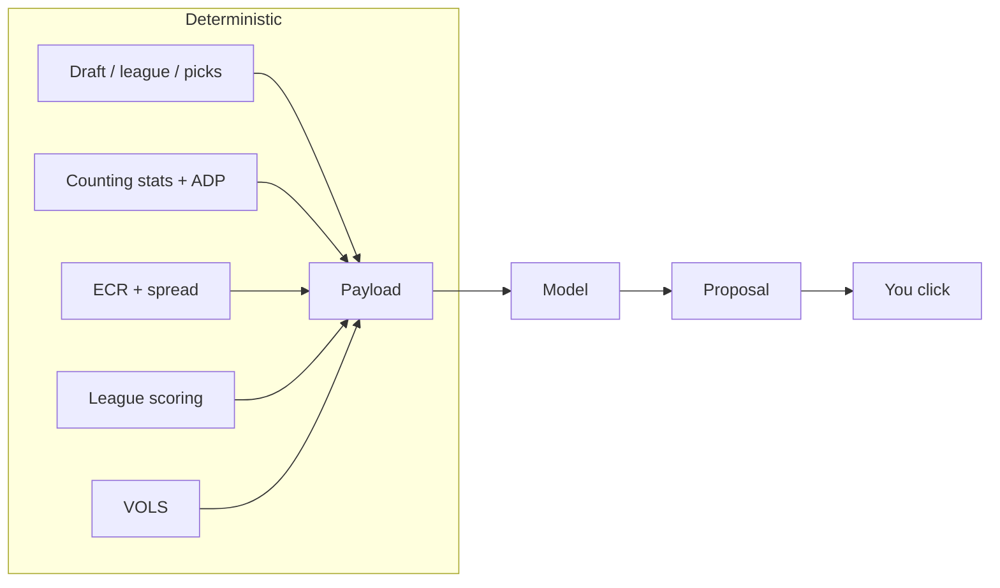
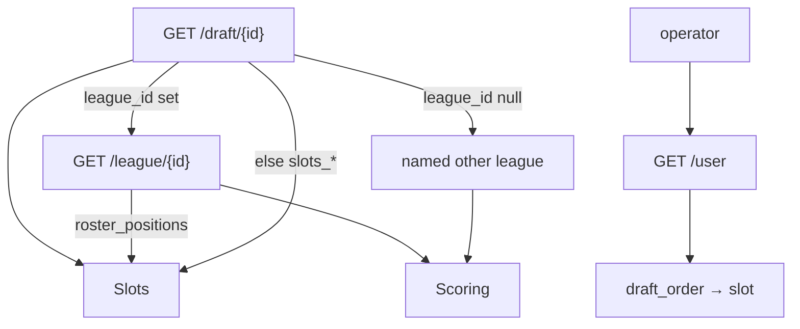
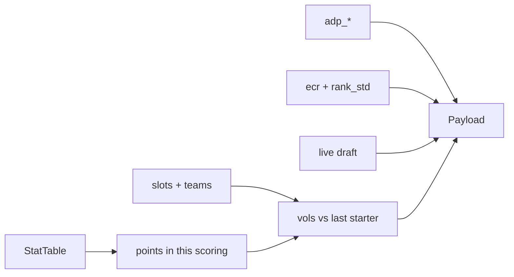

# vorpal

**Status:** proposal, pre-implementation.
**v1:** Sleeper NFL, snake redraft, offense-only. Personal tool.

An agent. Code builds a board of numbers. The model picks. You click in
Sleeper. The [Sleeper API is read-only](https://docs.sleeper.com/).



v1 is the draft loop. Lineup, waivers, trades: later, same payload shape.

---

## 1. Boundary

| In v1 | Out |
|---|---|
| Documented Sleeper reads | Any write / browser automation |
| Counting stats → this league's points → VOLS | Ingesting `pts_*` / fantasy-point columns |
| [FantasyPros ECR](https://www.fantasypros.com/api-data/) + `rank_std` as model inputs | ECR as the pick |
| Model recommendation | Argmax(VOLS) as the pick |
| Schema + golden set + dissent log | Fitting a league-history market model |
| Human executes | Multi-step search, run detector, VONA |

---

## 2. Configure

Inputs: **draft id**, **operator** (username or `user_id`), **scoring-source league id** iff `draft.league_id` is null, optional override CSV, FantasyPros API key.



[Draft](https://docs.sleeper.com/#get-a-specific-draft) has no `scoring_settings`. `metadata.scoring_type` is a label, not a table. Standalone mocks are readable and have `league_id: null`. Slots come from the mock; scoring is borrowed. Banner both. They may disagree.

**Slots, once:** league `roster_positions` if the draft belongs to a league; else `draft.settings.slots_*`. Infer bench only when `slots_bn` is absent and the league list did not fire: `rounds − starter slots`. A borrowed scoring league never overrides slots.

| Slot | Eligible |
|---|---|
| QB | QB |
| RB / WR / TE / K / DEF | that position |
| FLEX | RB, WR, TE |
| SUPER_FLEX, OP | QB, RB, WR, TE |
| BN | any |

IDP slot codes: refuse the draft.

**Seat.** Match operator `user_id` in `draft_order` (not `picked_by`, which is `""` for CPU). Unset order → proceed, omit `next_user_pick`. Partial order and operator missing → explicit slot or refuse. Complete order and operator missing → refuse.

### Refuse

| Condition | Signal |
|---|---|
| Keeper / dynasty | `settings.type ∈ {1,2}` or `taxi_slots > 0` |
| Unknown type | `type` absent or not in `{0,1,2}` (`0` = redraft, observed; `1`/`2` inferred) |
| IDP | IDP slots in the resolved list |
| Auction / linear / `reversal_round ≠ 0` | draft type / settings |

`max_keepers > 0` on `type == 0` is **not** a refusal. Banner *keepers possible* and proceed. When a pick has a truthy `is_keeper`, drop that player from the pool.

Four refusal classes, all loud: **format**, **data**, **platform**, **user**. No silent zeros.

---

## 3. Features (code) → payload (model)

All of this is computed. None of it is the pick. VBD terms:
[VORP / VOLS / VONA](https://support.fantasypros.com/hc/en-us/articles/115005868747-What-is-value-based-drafting-What-do-player-draft-values-mean-VORP-VONA-VOLS-VBD-).
Worked intuition: [What is value-based drafting?](https://www.fantasypros.com/2017/06/what-is-value-based-drafting/).



### Sources

| Feature | Source | Notes |
|---|---|---|
| League / draft / picks / players / user | Documented [`api.sleeper.app`](https://docs.sleeper.com/) | Stay under 1000 calls/min |
| Counting stats + ADP | Undocumented `GET https://api.sleeper.com/projections/nfl/{season}?season_type=regular&position[]=` | Same risk class as an internal API, **accepted**. Keyed by Sleeper `player_id`. Fetch **once per process**. Never poll. |
| ECR + spread | [FantasyPros consensus-rankings](https://api.fantasypros.com/public/v2/docs) | Required input. Join on `yahoo_id`. Superflex: `position=OP`. |
| Override | CSV keyed by `player_id` | Replaces stats + ADP if the projections host is down. No name match. |

Do not filter `/players` by `active=true`. `search_rank` is not ADP.

**Stats contract (Sleeper projections):** one `company` (currently `rotowire`) or data-refuse. Season totals (`week` null). Counting keys only — never ingest `pts_ppr` / `pts_std` / `pts_half_ppr`. Rows with ADP and no stats are market-only: exclude from VOLS, keep on the board. No `adp_2qb_ppr`.

**ADP variant**, from resolved slots + `rec` weight: SUPER_FLEX / OP / 2+ QB slots → `adp_2qb`; else `rec ≥ 0.75` → `adp_ppr`; `0.25–0.75` → `adp_half_ppr`; else `adp_std`. Banner when `rec` is not exactly `1/0.5/0`.

**ECR:** `rank_ecr`, `rank_min`, `rank_max`, `rank_std` (expert spread — this is the upside/uncertainty input). Scoring param STD/PPR/HALF follows the same `rec` rule. Join miss → omit ECR on that row, banner the count. FP down → banner `ecr_missing`, still call the model. Do not block a draft on ECR.

**Override columns:** `player_id` (required), counting stats the scoring keys need, `adp`. Optional: `adp_stdev`, name/team/pos. Endpoint down and no override → data refuse.

### Scoring

One function for RB/WR/TE: rush / rec / yards / TDs / fumbles. Position only changes replacement, plus rare premiums (`bonus_rec_te`, …). QB is `pass_*`. K and DST are their own keys. Longer prefix wins (`pass_int` is QB, not DST).

Every nonzero scoring key must hit a column. Unknown keys: **itemize**. Classified keys with no startable slot: one summary line. Operator proceeds (key = 0) or supplies an override.

### VOLS (v1 value)

Replacement = first player at that position **not absorbed into starting slots**. Bench is not absorbed. [VOLS, not waiver VORP](https://support.fantasypros.com/hc/en-us/articles/115005868747-What-is-value-based-drafting-What-do-player-draft-values-mean-VORP-VONA-VOLS-VBD-).

1. Rank by points. Fill dedicated slots (`T × slots_of_type`). Then FLEX, then SUPER_FLEX / OP (most-restrictive first).
2. Re-rank by that VOLS and fill once more. **Stop.** Superflex is why pass 1 exists.
3. Eval, not a third pass: a hypothetical pass 2 must not move any position's replacement rank by more than 2.

`vols = points − replacement[position].points`.

**Later, not v1:** waiver **VORP** (deeper baseline), **VONA** (value vs next pick — that *is* the model's wait/take judgment now).

---

## 4. The call

One call per board change. No tools. Closed world.

Omit `next_user_pick` when the seat is unknown. Do **not** ship a survival “band”; wait-vs-take is the model's.

**In**

```
{
  config: { teams, rounds, slot, slots[], scoring_summary, banners[] },
  state: {
    pick_no, next_user_pick?, picks_until_next?,
    user_roster: [{ player_id, name, position, bye }],
    needs: { [slot]: { filled, required } },
    recent: [{ player_id, position, pick_no }],   // last ~5
    available: [player_id]
  },
  replacement: { [pos]: { player_id, points } },
  hint_argmax_vols: player_id,                    // calculator, not the answer
  board: [{
    player_id, name, position, bye?,
    points, vols, adp,
    ecr?, ecr_min?, ecr_max?, ecr_std?,           // upside = wide std late
    legal_slots[]
  }]
}
```

**Out** (schema-constrained)

```
{
  player_id,                    // ∈ available
  alternatives: [player_id],    // ∈ available
  slot_filled,
  confidence: "clear" | "lean" | "coin_flip",
  why: string,
  flags: []                     // ECR_DISAGREE | BYE_STACK | POSITION_RUN
                                // | EMPTY_STARTER | UPSIDE | COIN_FLIP | …
}
```

- New `player_id`s are a failed call.
- The model may beat `hint_argmax_vols`. Silent dissent is a fail: set a flag and say why in `why`.
- Late picks: `vols` compress; prefer wider `ecr_std` (and `adp_stdev` if the override has it). That is the upside shift. Not a second scoring function.

---

## 5. Evals

The model is the policy. “Did we match argmax(VOLS)?” is not the gate.

| Gate | Pass |
|---|---|
| Schema | Rec ∈ `available`; `alternatives` ⊆ `available` |
| Golden set | Human labels are **sets** / forbids. Kicker round 3 = fail. Third TE while a starter slot is empty = fail. SF QB when two remain and eight teams need one = pass if that id is rec or alternative. No LLM-as-judge |
| Dissent | Rec ≠ `hint_argmax_vols` ⇒ a flag + a reason |
| Stability | Same payload, N samples: rec stays in a small set. Coin flips may move; golden forbids may not |
| Replay | Dated `StatTable` + frozen others' picks. Score both rosters on **those same projections** (optimal lineup). Actuals are luck. No dated file → `NOT_PERFORMED` |

Sampler for golden / stability boards: ADP order + noise, plus hostile states (a position emptied, flex full, last pick). Do not sample from the model.

---

## 6. Draft night

Local display, documented draft API only.

- `drafting`: poll 3s. Else until `complete`: 15s. Never poll projections or FantasyPros on this loop.
- Error backoff: 5s, 15s, 45s, hold. Reset on success.
- Always show data age. Past 15s, degrade. Grey-out at `pick_timer` (skip grey-out if timer is 0/null).
- `status` from `draft.status`, not `start_time`. Observed: `pre_draft`, `drafting`, `complete`.

---

## 7. Later

| Phase | What |
|---|---|
| v2 | Weekly lineup |
| v3 | Waivers / FAAB |
| v4 | Trades |
| — | Waiver VORP; VONA if we ever *measure* survival; fitted market model (needs many seasons) |

Not a product: executing picks, outbound trades without review, multi-sport in v1. Shared layer if/when NBA/FPL/brackets exist: ingestion + projections only. Each sport keeps its own decision prompt.

---

## 8. Risks and ethics

- The model is the policy. Golden set is small and human. That is the main eval limit.
- Default stats host is unofficial and can vanish. Override only helps if it already exists. Draft night is the worst time to learn this.
- `ecr_std` is expert-rank spread, not pick-number σ. Good enough as an upside feature; do not present it as calibrated survival.
- Superflex is where two-pass VOLS is most likely to move. The rank-2 invariant is an eval, not a solver.
- Disclose to the league that you use a tool. Also disclose Rotowire-via-unofficial-Sleeper and FantasyPros ECR — “I used a public cheat sheet” does not cover it.
- Do not commit league data (other managers, transactions) to a shared repo.
- A market model on *this league's* history is a different disclosure if it is ever built.
