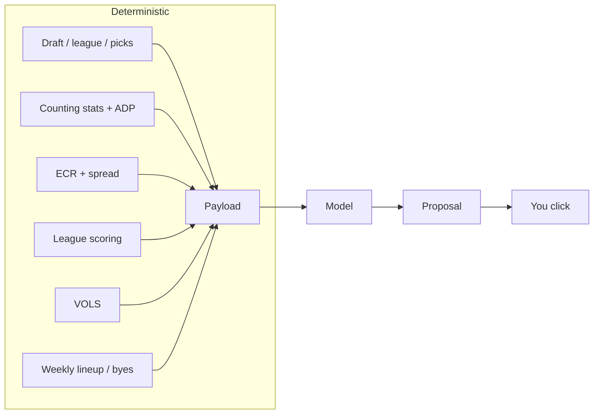
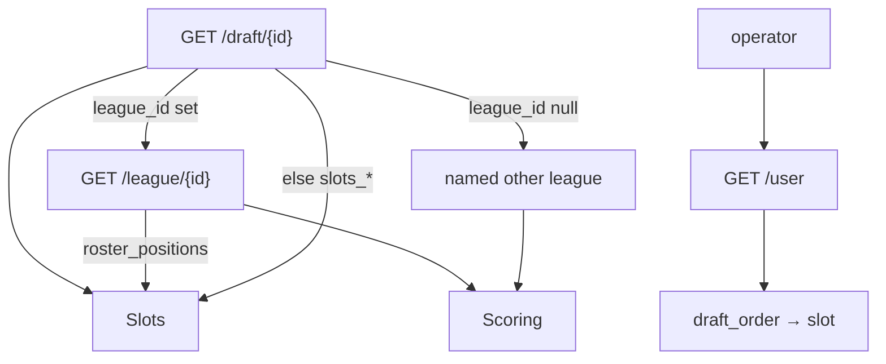
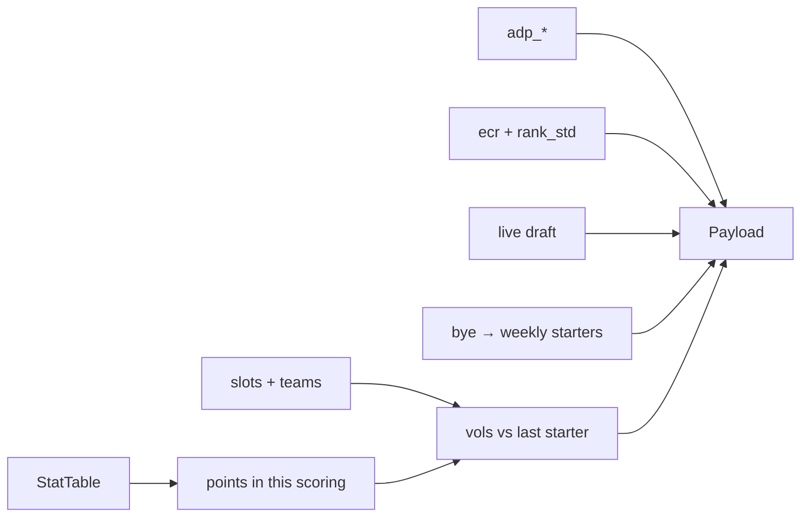
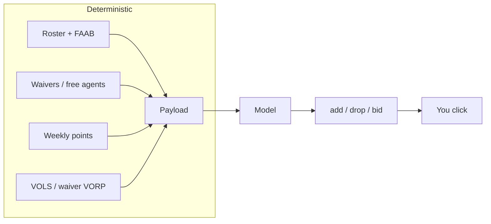

# vorpal

**Status:** proposal, pre-implementation.
**v1:** Sleeper NFL, snake redraft, offense-only. Personal tool.

An agent. Code builds a board of numbers. The model picks. You click in
Sleeper. The [Sleeper API is read-only](https://docs.sleeper.com/).



v1 is the draft loop. Waivers and lineups reuse this shape; diagram in §7.

---

## 1. Boundary

| In v1 | Out |
|---|---|
| Documented Sleeper reads | Any write / browser automation |
| Counting stats → this league's points → VOLS | Ingesting fantasy-point columns (`points`, `pts_*`) |
| [FantasyPros](https://www.fantasypros.com/api-data/) stats, ADP, ECR + `rank_std` as inputs **and** a sanity eval | ECR as the pick |
| Weekly starter points (bye = 0) | True weekly projections (v2) |
| Model recommendation | Argmax(VOLS) as the pick |
| Binary evals only | Soft scores, “lean”, calibrated probabilities |
| Human executes | Multi-step search, run detector, VONA |

---

## 2. Configure

Inputs: **draft id**, **operator** (username or `user_id`), **scoring-source league id** iff `draft.league_id` is null, optional override CSV, FantasyPros API key.



[Draft](https://docs.sleeper.com/#get-a-specific-draft) has no `scoring_settings`. `metadata.scoring_type` is a label, not a table. Standalone mocks are readable and have `league_id: null`. Slots come from the mock; scoring is borrowed. Banner both. They may disagree.

**Slots, once:** league `roster_positions` if the draft belongs to a league; else `draft.settings.slots_*`. Infer bench only when `slots_bn` is absent and the league list did not fire: `rounds − starter slots`. A borrowed scoring league never overrides slots.

| Slot | Eligible |
|---|---|
| QB | QB |
| RB / WR / TE / K / DEF | that position |
| FLEX | RB, WR, TE |
| SUPER_FLEX, OP | QB, RB, WR, TE |
| BN | any |

IDP slot codes: refuse the draft.

**Seat.** Match operator `user_id` in `draft_order` (not `picked_by`, which is `""` for CPU). Unset order → proceed, omit `next_user_pick`. Partial order and operator missing → explicit slot or refuse. Complete order and operator missing → refuse.

### Refuse

| Condition | Signal |
|---|---|
| Keeper / dynasty | `settings.type ∈ {1,2}` or `taxi_slots > 0` |
| Unknown type | `type` absent or not in `{0,1,2}` (`0` = redraft, observed; `1`/`2` inferred) |
| IDP | IDP slots in the resolved list |
| Auction / linear / `reversal_round ≠ 0` | draft type / settings |

`max_keepers > 0` on `type == 0` is **not** a refusal. Banner *keepers possible* and proceed. When a pick has a truthy `is_keeper`, drop that player from the pool.

Four refusal classes, all loud: **format**, **data**, **platform**, **user**. No silent zeros.

---

## 3. Features (code) → payload (model)

All of this is computed. None of it is the pick. VBD terms:
[VORP / VOLS / VONA](https://support.fantasypros.com/hc/en-us/articles/115005868747-What-is-value-based-drafting-What-do-player-draft-values-mean-VORP-VONA-VOLS-VBD-).
Worked intuition: [What is value-based drafting?](https://www.fantasypros.com/2017/06/what-is-value-based-drafting/).



### Sources

| Feature | Source | Notes |
|---|---|---|
| League / draft / picks / players / user | Host. v1: documented [`api.sleeper.app`](https://docs.sleeper.com/) | Stay under 1000 calls/min. `/players` is the join directory (host id, `yahoo_id`, name, pos, team). |
| Counting stats + ADP + bye | [FantasyPros](https://api.fantasypros.com/public/v2/docs) projections and ADP | Host-neutral forecast. Fetch **once per process**. Never poll. Join to host `player_id`. |
| ECR + spread | FantasyPros consensus-rankings | Required input. One overall list: `position=ALL` (1QB) or `OP` (superflex). Join on `yahoo_id`, then name. `rank_ecr` is overall draft order, not positional. |
| Override | CSV keyed by host `player_id` | Replaces stats + ADP if FantasyPros projections are down. No name match. |

Do not filter `/players` by `active=true`. `search_rank` is not ADP.

**Stats contract (FantasyPros):** season totals (`week=0`). Counting keys only — never ingest `points` / `points_ppr` / `points_half` / `pts_ppr` / `pts_std` / `pts_half_ppr`. Map FP stat names onto this **host's** scoring keys (`pass_yds` → Sleeper `pass_yd`). ESPN has no rows yet. Do not invent kicker distance buckets or `pts_allow_*` from coarse FP fields (`fg`, `pa`). Unmatched nonzero scoring keys banner; they must not silent-zero. Rows with ADP and no stats are market-only: exclude from VOLS, keep on the board.

**ADP variant**, from resolved slots + `rec` weight: SUPER_FLEX / OP / 2+ QB slots → `2qb`; else `rec ≥ 0.75` → `ppr`; `0.25–0.75` → `half_ppr`; else `std`. Banner when `rec` is not exactly `1/0.5/0`. Ingest maps that onto FantasyPros ADP (`2qb` → `position=OP`; else `ALL` with STD/PPR/HALF). If OP ADP is empty, use 1QB ADP and banner `adp_1qb_market`. There is no `adp_2qb_ppr`.

**ECR:** `rank_ecr`, `rank_min`, `rank_max`, `rank_std` (expert spread — this is the upside/uncertainty input). One overall consensus list: `ALL` in 1QB, `OP` in superflex. Scoring param STD/PPR/HALF follows the same `rec` rule. Do not stitch positional lists — those ranks all start at 1 and are not `ecr_best`. Join miss → omit ECR on that row, banner the count. FP down → banner `ecr_missing`, still call the model. Do not block a draft on ECR. Missing ECR skips the ECR eval, it does not fail it.

**Weekly / byes / absence.** Host `/players` has no bye. Take bye from FantasyPros (`player_bye_week`). v1 does not fetch weekly projections. For weeks `1..18`, rate = `points / 17` (or `/ gp` when present); **0 on that player's bye**, and **0 on weeks the player is known out** — a served suspension is weeks `1..n`. Dividing by `gp` and then filling every non-bye week rebuilds a full season for a player who does not play one. Where `gp < 17` and the missed weeks are not knowable, do not guess which: ship `gp` on the board row and let the model read the gap between season `points` and per-game rate. That gap is the whole case for a discounted returning starter, and season totals hide it. Fill the user's starting slots by those rates. Ship the 18-week vector: starter points and any empty startable slot. That is week-by-week strength. v2 replaces the rate with real weekly stats.

**Marginal value.** Recompute that vector with a candidate added and ship the
difference as `delta_starter_points` on each board row. `vols` is global — the
same number whether you hold zero RBs or four. This is the same player against
*your* roster. Byes are already zeros in the vector, so a bye stack shows up as
a smaller delta instead of as arithmetic the model has to do in its head.

**Override columns:** `player_id` (required), counting stats the scoring keys need, `adp`. Optional: `adp_stdev`, name/team/pos. Endpoint down and no override → data refuse.

### Scoring

One function for RB/WR/TE: rush / rec / yards / TDs / fumbles. Position only changes replacement, plus rare premiums (`bonus_rec_te`, …). QB is `pass_*`. K and DST are their own keys. Longer prefix wins (`pass_int` is QB, not DST).

Every nonzero scoring key must hit a column. Unknown keys: **itemize**. Classified keys with no startable slot: one summary line. Operator proceeds (key = 0) or supplies an override.

### VOLS (v1 value)

Replacement = first player at that position **not absorbed into starting slots**. Bench is not absorbed. [VOLS, not waiver VORP](https://support.fantasypros.com/hc/en-us/articles/115005868747-What-is-value-based-drafting-What-do-player-draft-values-mean-VORP-VONA-VOLS-VBD-).

1. Rank by points. Fill dedicated slots (`T × slots_of_type`). Then FLEX, then SUPER_FLEX / OP (most-restrictive first).
2. Re-rank by that VOLS and fill once more. **Stop.** Superflex is why pass 1 exists.
3. Eval, not a third pass: a hypothetical pass 2 must not move any position's replacement rank by more than 2.

`vols = points − replacement[position].points`.

**Later, not v1:** waiver **VORP** (deeper baseline), **VONA** (value vs next pick — that *is* the model's wait/take judgment now).

---

## 4. The call

One call per board change. No tools. Closed world.

**No tools is a draft-phase constraint, not an architecture.** Two reasons, both
local to draft night: every round trip runs against the pick timer, and the
stability gate needs identical payloads to converge. Sampling parameters cannot
be used to force that — `temperature` is rejected on current models — so
determinism has to come from a closed input.

Later phases have hours, not seconds. When they admit tools, the rule is a
split by kind, not a cap on count: a tool that is a **pure function of the board**
(depth chart, bye, any snapshot the payload could have carried) keeps the same
payload converging on the same call and the same data, so stability survives. A
tool that reaches into a **changing world** (live news, search) does not, and
worse, lets the model act on data no gate ever sees — which is what hollows out
`VOLS_DISSENT`. Admit the first kind. A tool that is down gets the `ecr_missing`
treatment: banner and proceed, never block.

**The board is the world.** Rec and alternatives must be on `board` — not merely
undrafted. Order by `vols` descending. State in the payload that the board is
capped, so the model does not read scarcity off a truncated list.

**The cap is a union of three arms.** A player on any one arm is on the board.

1. **Top 50 overall** by `vols`.
2. **Top `depth(position)` per position**, where depth answers "how many of these
   could still start for you": `2 + 2 × remaining`, capped at 10, where
   `remaining` is the unfilled starter need any slot this position can fill
   (a FLEX need counts for RB, WR, and TE alike). A position with every starter
   seated keeps a floor of 2 — enough that a value pick is still nameable, not
   enough to crowd the board. A fixed 10 per position spends the same rows on a
   filled QB room as on an empty one.
3. **The ADP window, in two halves.** *Forward:* every player whose `adp` falls
   between `pick_no` and `pick_no + 2 × teams` — the next two rounds. That set is
   about two rounds wide by construction, so it needs no bound. *Backward:* the
   **`teams` biggest fallers** — players still undrafted whose ADP is already
   behind the clock, taken lowest ADP first. A faller is the most interesting row
   on the board and `vols` alone will not surface him, because market-only rows
   carry ADP and no stats and are excluded from VOLS by construction.

   The backward half is capped for a measured reason. Unbounded, it eats the late
   board: by pick 165 most of what is left has an ADP behind the clock, so
   "everyone the market was wrong about" stops being a shortlist. In simulation
   an unbounded backward half put 125 of the 187 remaining players on the board.
   One round of the biggest falls holds it at 87.

**K and DEF are deferred.** Arm 2 is `depth = 0` for them until the last two
rounds *and* a starter slot is still empty. Ten kickers and ten defenses on a
round-1 board is a fifth of the rows for a decision nobody makes before round 13.
Arm 3 still reaches them on its own: kicker ADP enters the window exactly when
kickers start going. The late-round clause is the backstop for a league whose K
or DEF ADP never arrives.

Omit `next_user_pick` and `between` when the seat is unknown. Do **not** ship a survival “band”; wait-vs-take is the model's.

**In**

```
{
  config: { teams, rounds, slot, slots[], scoring_summary, banners[] },
  state: {
    pick_no, next_user_pick?, picks_until_next?,
    user_roster: [{ player_id, name, position, bye }],
    needs: { [slot]: { filled, required } },
    weekly: [{ week, starter_points, empty: [slot] }],  // bye → 0
    recent: [{ player_id, position, pick_no }],         // last ~5
    between: [{ slot, roster: { [pos]: n }, needs }]    // teams picking before next_user_pick
  },
  replacement: { [pos]: { player_id, points } },
  hint_argmax_vols: player_id,                    // calculator, not the answer
  board: [{                                       // vols desc, capped
    player_id, name, position, bye?,
    points, gp?, vols, delta_starter_points, adp, // vols is global; delta is vs your roster
                                                  // gp < 17 ⇒ season points understate per-game value
    ecr?, ecr_min?, ecr_max?, ecr_std?,           // upside = wide std late
    legal_slots[]
  }]
}
```

**Out** (schema-constrained)

```
{
  player_id,                 // ∈ available
  alternatives: [player_id], // ∈ available
  slot_filled,
  coin_flip: bool,           // only extra bit. true ⇒ skip stability
  why: string,               // human; not scored
  flags: []                  // closed enum. presence is the eval
}
```

`flags` ∈ `ECR_DISAGREE | BYE_STACK | POSITION_RUN | EMPTY_STARTER | UPSIDE | VOLS_DISSENT`.

**Violations.** Every rule below fails the *call*. None of them fails the *run*.
The operator is on a pick timer: a validator that exits 2 hands them nothing at
the one moment they cannot recover. So validation returns violations, and the
caller decides what they mean.

- Ids not on `board` → violation.
- Rec ≠ `hint_argmax_vols` → `VOLS_DISSENT` must be set. Silent dissent → violation.
- Rec is not the best available ECR → `ECR_DISAGREE`. Beyond `ecr_best + margin`
  → violation. The flag does not save it. **One exception:** a rec whose
  `ecr_min` is inside the ceiling passes. `ecr` is the consensus median, and the
  margin rule exists to catch a rec no expert would make — not to punish the
  wide-spread upside pick that some experts rank inside the ceiling and others
  far outside. `ecr_std` is the upside input; a floor that ignores `ecr_min`
  would discard exactly the picks that input is for.
- Late picks: `vols` compress; prefer wider `ecr_std` (and `adp_stdev` if the
  override has it). Not a second scorer.

**Draft night:** one retry on a violation, then fall back to `hint_argmax_vols`
— the calculator answer — with a banner naming what the model got wrong. A
degraded pick beats no pick. **Eval run:** violations are the score. Never
retried, never degraded, never hidden.

A malformed HTTP response, a transport failure, or a body that is not JSON is a
`PlatformError`, not a violation. That is the host being broken, not the model
being wrong.

---

## 5. Evals

Every gate is **pass or fail**. No scores, no “lean”, no margin-as-a-grade. Skip a gate when its input is missing (`NOT_PERFORMED`) — that is not a fail.

Let `T = config.teams`. `ecr_best` = min ECR among `board` players that have an ECR (overall consensus list, not positional). `margin = T` in the first half of the draft, else `2T` (one round, then two).

| Gate | Pass iff |
|---|---|
| Schema | Rec ∈ `board` ∧ alternatives ⊆ `board` ∧ `slot_filled` is legal for rec |
| Golden forbid | Rec is not in the forbid set (kicker rounds 1–3; third TE while a dedicated starter slot is empty; …) |
| Golden require | Rec or an alternative **is** in the require set (e.g. SF QB when two remain and eight teams need one) |
| VOLS dissent | Rec = `hint_argmax_vols` **xor** `VOLS_DISSENT` ∈ flags |
| ECR dissent | No ECR → skip. Else rec is `ecr_best` **xor** `ECR_DISAGREE` ∈ flags |
| ECR sanity | No ECR on rec → skip. Else `ecr(rec) ≤ ecr_best + margin` **or** `ecr_min(rec) ≤ ecr_best + margin`. Floor, not a target: one round off early, two late |
| Bye hole | Adding rec does not create a new empty startable slot on `rec.bye` when an alternative with a different bye exists on the board |
| Stability | `coin_flip` → skip. Else ≥ 3 of 5 identical payloads return the same `player_id` |
| VOLS invariant | Hypothetical pass 2 moves no position's replacement rank by more than 2 |
| Regret | No completed-draft fixture → skip. Else fail iff rec was still available at `next_user_pick` **and** a listed alternative was not |
| Replay | No dated file → skip. Else policy's projected-lineup sum ≥ user's, same dated stats. Actuals are luck |

No LLM-as-judge. Sampler for golden/stability: ADP order + noise, plus hostile states. Do not sample from the model.

**Regret fixtures.** Completed public drafts, read through the same documented
API, replayed to a user pick with the board frozen. Who survived to that user's
next turn is a matter of record — no survival model, no judge. This is the only
gate on wait-vs-take, which §1 hands to the model outright.

### Baselines

Every fixture also runs through three fixed policies. Report four pass rates per
gate, side by side.

| Policy | Rule |
|---|---|
| `argmax_vols` | `hint_argmax_vols`; flags set mechanically |
| `adp_follow` | best available `adp` |
| `ecr_follow` | best available `ecr` |

`argmax_vols` passes most gates above as written. That is the point. A gate where
the model and `argmax_vols` post the same rate has no discriminating power, and
§1 already puts argmax-as-the-pick out of scope. The model separates or it is not
paying for its tokens.

---

## 6. Draft night

Local display, documented draft API only.

- `drafting`: poll 3s. Else until `complete`: 15s. Never poll projections or FantasyPros on this loop.
- Error backoff: 5s, 15s, 45s, hold. Reset on success.
- Always show data age. Past 15s, degrade. Grey-out at `pick_timer` (skip grey-out if timer is 0/null).
- `status` from `draft.status`, not `start_time`. Observed: `pre_draft`, `drafting`, `complete`.

---

## 7. Later



Same contract as draft: numbers in, binary-gated rec out, you click. v2 swaps the bye-rate weekly vector for real weekly stats (start/sit). v3 is the diagram above. v4 is two roster valuations, inbound then outbound.

| Phase | What |
|---|---|
| v2 | Weekly lineup from weekly projections |
| v3 | Waivers / FAAB. First tool phase: depth chart (backups, handcuffs) |
| v4 | Trades |
| — | Waiver VORP; VONA once the regret set holds enough drafts to fit survival; fitted market model; playoff-week schedule strength |

Not a product: executing picks, outbound trades without review, multi-sport in v1. Shared layer if/when NBA/FPL/brackets exist: ingestion + projections only. Each sport keeps its own decision prompt.

---

## 8. Risks and ethics

- The model is the policy. Golden set is small and human. That is the main eval limit. Baselines and the regret set bound it; neither replaces it.
- Weekly strength in v1 is season rate with bye and known-out weeks at 0, not a real week-17 forecast.
- Every gate is a floor or a consistency check. None of them scores *riskiness*, so nothing catches a recommendation that should have chased variance and did not. This matters once the objective shifts from `max E[points]` toward `max P(beat opponent)` — a v2/v3 concern, unaddressed here.
- FantasyPros can be down. Override only helps if it already exists. Draft night is the worst time to learn this.
- `ecr_std` is expert-rank spread, not pick-number σ. Good enough as an upside feature; do not present it as calibrated survival.
- ECR sanity is a floor, not a target. Superflex / TE-premium boards will trip `ECR_DISAGREE` on purpose; they still must stay inside `margin`. The `ecr_min` escape exists so the gate catches incoherence rather than contrarianism: a returning starter the consensus discounts but one expert ranks highly is a fact on the board, not a taste. It widens the floor — a player no expert likes still fails.
- Superflex is where two-pass VOLS is most likely to move. The rank-2 invariant is an eval, not a solver.
- Disclose to the league that you use a tool. Also disclose FantasyPros projections and ECR — “I used a public cheat sheet” does not cover it.
- Regret fixtures are other people's completed drafts. Survival in them is fact, not forecast — but their board is their ADP era, not yours. Same no-commit rule as league data.
- Do not commit league data (other managers, transactions) to a shared repo.
- A market model on *this league's* history is a different disclosure if it is ever built.
